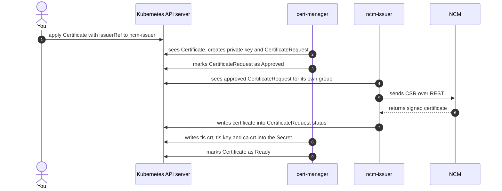

# How it works

This page explains what ncm-issuer does, what cert-manager does and how the two together turn
a certificate request into a ready to use Kubernetes `Secret` signed by NCM.

No prior knowledge of Kubernetes controllers is required.

## The three parts

| Component       | What it is                                          | What it is responsible for                                                        |
|:----------------|:----------------------------------------------------|:----------------------------------------------------------------------------------|
| **cert-manager** | A certificate lifecycle manager for Kubernetes      | Generates private keys and CSRs, tracks expiry, triggers renewal, writes `Secrets` |
| **ncm-issuer**  | A small Kubernetes controller (external issuer)     | Takes CSRs meant for NCM, sends them to NCM, returns the signed certificate        |
| **NCM**         | The Nokia NetGuard Certificate Manager PKI system   | The certificate authority that actually signs                                      |

cert-manager and ncm-issuer both run inside the Kubernetes cluster. NCM usually runs outside it.

## The key idea

**cert-manager and ncm-issuer never call each other.** There is no client and no server between them,
no REST API, no gRPC and no shared file system.

Both are controllers. A controller is a program that watches objects in the Kubernetes API and reacts
to changes. So the two components communicate the way all Kubernetes controllers do: one writes an
object, the other notices it and writes something back.

The only component that both of them connect to is the Kubernetes API server. The only component that
connects to NCM is ncm-issuer.

```text
                        +--------------------------+
                        |  Kubernetes API server   |
                        +--------------------------+
                            ^                  ^
             watch / update |                  | watch / update
                            |                  |
                  +----------------+    +----------------+
                  |  cert-manager  |    |   ncm-issuer   |
                  +----------------+    +----------------+
                                                |
                                                | REST over HTTPS
                                                v
                                          +------------+
                                          |    NCM     |
                                          +------------+
```

## What you create

Two kinds of resources, owned by two different API groups.

| Resource                      | API group                     | Created by       | Purpose                                     |
|:------------------------------|:------------------------------|:-----------------|:--------------------------------------------|
| `Issuer` / `ClusterIssuer`    | `certmanager.ncm.nokia.com`   | You, once        | Where NCM is, which CA to use, credentials  |
| `Certificate`                 | `cert-manager.io`             | You, per workload | What certificate your application needs     |

The link between them is the `issuerRef` field of the `Certificate`:

```yaml title="certificate.yaml" hl_lines="9 10 11 12"
apiVersion: cert-manager.io/v1
kind: Certificate
metadata:
  name: example-ncm-certificate
  namespace: example-ncm-ns
spec:
  commonName: example-ncm-certificate-nokia-ncm.local
  secretName: example-ncm-certificate-nokia-ncm-tls
  issuerRef:
    group: certmanager.ncm.nokia.com
    kind: Issuer
    name: example-ncm-issuer
```

That `group` value is the whole contract. ncm-issuer only acts on requests whose `issuerRef.group` is
`certmanager.ncm.nokia.com` and ignores everything else. This is how several issuers can coexist in
one cluster without interfering with each other.

## The flow, step by step

### Before anything: the Issuer becomes ready

When you create an `Issuer` or `ClusterIssuer`, ncm-issuer reads the referenced `Secrets` for the NCM
credentials and the optional TLS material, builds an NCM API client and performs a health check
against the NCM API. On success the resource is marked `Ready` with reason `Verified`. Nothing will be
signed until this is true.

```bash
$ kubectl get ncmissuers -n example-ncm-ns
NAME                 AGE   READY   REASON     MESSAGE
example-ncm-issuer   3s    True    Verified   Signing CA verified and ready to sign certificates
```

### 1. You ask for a certificate

You apply the `Certificate` shown above. At this point nothing else exists yet.

### 2. cert-manager prepares the request

cert-manager notices the new `Certificate`. It generates a **private key inside the cluster**, builds
a certificate signing request (CSR) from it and creates a `CertificateRequest` object that carries the
CSR plus the same `issuerRef` you specified.

!!! note
    The private key is generated by cert-manager and stays in the cluster. It is never sent to NCM and
    ncm-issuer never reads it. Only the CSR travels to NCM.

### 3. cert-manager approves the request

cert-manager has a built in approver. It marks the `CertificateRequest` as `Approved`. This requires
permission to approve the ncm-issuer signer type, which the ncm-issuer Helm chart installs for you.

!!! warning
    If that permission is missing, the request stays unapproved and nothing is ever signed. ncm-issuer
    deliberately refuses to sign requests that are not approved, as required by the cert-manager
    specification for external issuers.

### 4. ncm-issuer picks the request up

ncm-issuer watches every `CertificateRequest` in the cluster. For each one it checks in order whether
the request belongs to it, whether it was approved, whether the referenced `Issuer` exists and is
`Ready` and whether the CSR is usable. Requests belonging to other issuers are dropped immediately.

### 5. ncm-issuer talks to NCM

ncm-issuer looks up the configured CA in NCM, walks the CA chain, then sends the CSR to the NCM REST
API and asks NCM for the status of that request.

* If NCM accepted the request, ncm-issuer downloads the signed certificate.
* If the request needs manual approval in NCM, ncm-issuer remembers it and checks again once a minute
  for about 24 hours before giving up.
* If NCM rejected the request, ncm-issuer stops and reports it.

### 6. ncm-issuer writes the answer back

ncm-issuer writes the signed certificate and the CA certificate into the **status of the same
`CertificateRequest`** and marks it `Ready` with reason `Issued`. This is the only thing ncm-issuer
gives back. It does not create your TLS `Secret`.

It also stores the NCM certificate identifier in a small helper `Secret` named
`<certificate-name>-details`, which is needed later for renewal.

### 7. cert-manager stores the certificate

cert-manager sees the completed `CertificateRequest`, combines the certificate with the private key it
kept and writes `tls.crt`, `tls.key` and `ca.crt` into the `Secret` named in `spec.secretName`. The
`Certificate` becomes `Ready`.

Your application mounts that `Secret`. It never needs to know that NCM exists.

```bash
$ kubectl get certificates -n example-ncm-ns
NAME                      READY   SECRET                                  AGE
example-ncm-certificate   True    example-ncm-certificate-nokia-ncm-tls   17s
```

### 8. Renewal happens by itself

cert-manager watches the expiry date. When renewal is due it creates a **new** `CertificateRequest` and
the same flow runs again. Depending on the private key rotation policy, ncm-issuer either renews the
existing certificate in NCM or enrolls a new one. See
[renewing or re-enrolling](certificates/certificates.md) for the details.

## The whole flow in one picture



## Who owns what

| Step                                  | cert-manager | ncm-issuer | NCM |
|:--------------------------------------|:------------:|:----------:|:---:|
| Deciding a certificate is needed      | yes          | no         | no  |
| Generating the private key            | yes          | no         | no  |
| Building the CSR                      | yes          | no         | no  |
| Approving the request                 | yes          | no         | no  |
| Talking to NCM                        | no           | yes        | -   |
| Signing the certificate               | no           | no         | yes |
| Writing the TLS `Secret`              | yes          | no         | no  |
| Tracking expiry and starting renewal  | yes          | no         | no  |

## Why a separate component is needed

cert-manager does not know how to talk to NCM and it cannot be configured to do so. It only supports
the certificate authorities built into its own code base.

The cert-manager project stopped adding new certificate authority integrations to that code base on
purpose. New integrations are expected to be
[external issuers](https://cert-manager.io/docs/contributing/external-issuers/): separate small
controllers that plug into the same `CertificateRequest` workflow. cert-manager treats them exactly
like its built in issuers.

ncm-issuer is that external issuer for NCM. It is listed on the official
[cert-manager issuers page](https://cert-manager.io/docs/configuration/issuers/) next to the
integrations for AWS Private CA, Google Cloud CAS, EJBCA, Keyfactor Command, Microsoft ADCS and
others. All of them are deployed the same way, as an extra controller in the cluster.

## Common questions

**Is ncm-issuer a normal application or a CNF?**
No. It is a Kubernetes controller. It exposes no service to your workloads, it receives no traffic and
nothing connects to it. It only watches the Kubernetes API and calls the NCM REST API outbound. The
container image is around 18 MB and a single replica is enough.

**Must ncm-issuer run on the same worker node as cert-manager?**
No. They never communicate directly, so placement is unrelated. The only thing that matters is that
the ncm-issuer pod can reach the NCM API. The Helm chart provides `nodeSelector` and `tolerations` if
you need to pin it to nodes with that connectivity.

**Must ncm-issuer run in the same namespace as cert-manager?**
No. Any namespace works and the documentation uses a dedicated `ncm-issuer` namespace by convention.
If you do install it into the cert-manager namespace, keep `certManagerRbac.namespace` pointing at the
namespace that holds the cert-manager `ServiceAccount`.

**Can ncm-issuer be installed outside the cluster, for example on the NCM host?**
No. It has to watch `CertificateRequest` objects and update them. The resulting certificates also have
to end up in `Secrets` inside the cluster. Both are only possible from a component running as part of
the cluster. There is nothing to install on the NCM side.

**How many instances do I need?**
One per Kubernetes cluster. Within a cluster a single deployment serves every namespace. Use a
`ClusterIssuer` if you want one NCM configuration shared by all namespaces or an `Issuer` per
namespace if teams should manage their own. Run more than one replica only for high availability, in
which case leader election keeps a single replica active.

## Where to go next

* [Installation](installation.md) and [configuration](configuration.md)
* [Issuer](CRDs/issuer.md) and [ClusterIssuer](CRDs/cluster-issuer.md) reference
* [Issuing your first certificate](tutorials/first-certificate.md)
* [Troubleshooting](troubleshooting.md)
