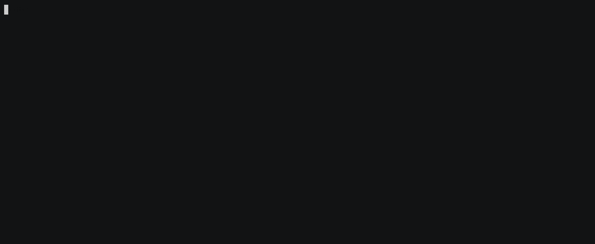

# Installation

## Prerequisites

Prerequisites for using ncm-issuer:

* [NCM](https://www.nokia.com/networks/products/pki-authority-with-netguard-certificate-manager/) release 23 or later,
* [Kubernetes](https://kubernetes.io) version 1.26 - 1.36,
* [cert-manager](https://cert-manager.io/) version 1.0.0 or later,
* Kubernetes container runtime like Docker, containerd or CRI-O,
* [Helm](https://helm.sh/docs/intro/install/) v3.

## Resource requirements

The following resource requirements are based on the default configuration for ncm-issuer:

| Resource Type | Configuration | CPU | Memory | Disk (per node) |
|:--------------|:--------------|:----|:-------|:----------------|
| **Minimum** | Single replica, no sidecar | 400m (0.4 cores) | 500Mi | 500 MB |
| **With sidecar** | Single replica, troubleshooting sidecar enabled | 800m (0.8 cores) | 1000Mi (1 Gi) | 1 GB |
| **High Availability** | Multiple replicas (leader election enabled) | 400m × replicas | 500Mi × replicas | 500 MB + (100 MB × replicas) |

**Container Image Sizes:**
* ncm-issuer: ~18 MB
* ncm-issuer-utils (optional sidecar): ~170 MB

**Note**: These requirements are for the ncm-issuer component only. Additional resources are required for cert-manager, which is a separate dependency. The actual resource consumption may vary based on:
* Number of Issuer/ClusterIssuer resources
* Certificate request frequency
* NCM API response times
* Logging verbosity level

## Installing with Helm

The easiest way to install ncm-issuer in a Kubernetes cluster is to use Helm.
The container image will be downloaded automatically from the public registry.

<figure markdown>
  
</figure>

The chart is published on GitHub Pages as a public Helm chart repository at
`https://nokia.github.io/ncm-issuer/charts` (this URL is consumed by the `helm` CLI
which fetches `/index.yaml` from it).

Pick one of the three install flows below based on your situation. They are equivalent
in the resulting deployment. The first flow does not require cloning the repository.

!!! note
    The Helm repo alias `nokia` used below is just a local nickname picked at `helm repo add`.
    You can use any name you want.

### From the public Helm chart repository (recommended)

Add the repository:

  ```bash
  helm repo add nokia https://nokia.github.io/ncm-issuer/charts
  ```

Update your local Helm chart repository cache:

  ```bash
  helm repo update
  ```

Install ncm-issuer:

  ```bash
  helm install \
  ncm-issuer nokia/ncm-issuer \
  --create-namespace --namespace ncm-issuer
  ```

To list available chart versions:

  ```bash
  helm search repo nokia/ncm-issuer -l
  ```

### From a packaged chart (`.tgz`)

Useful when working offline or behind a corporate mirror. Pull the packaged chart:

  ```bash
  helm pull nokia/ncm-issuer
  ```

This produces a file like `ncm-issuer-<chart-version>.tgz` in the current directory.
Install it directly:

  ```bash
  helm install \
  ncm-issuer ./ncm-issuer-<chart-version>.tgz \
  --create-namespace --namespace ncm-issuer
  ```

You can also download the `.tgz` manually from the chart repository (URLs are listed in
[`index.yaml`](https://nokia.github.io/ncm-issuer/charts/index.yaml)) or mirror it to
an internal artifact store before installing.

### From a cloned repository (development / customization)

Use this flow if you want to modify the chart sources or build everything from `main`:

  ```bash
  git clone https://github.com/nokia/ncm-issuer.git
  cd ncm-issuer
  helm install \
  ncm-issuer ./helm \
  --create-namespace --namespace ncm-issuer
  ```

## Using own (local or remote) registry

In case you want to use your own registry, just change the value pointing to a specific registry
in the `values.yaml` file in directory that contains Helm files. Then just repeat the steps
mentioned above.

  ```bash
  sed -i "s|ghcr.io/nokia|<your-registry>|g" values.yaml
  ```

!!! note
    Using this command will also change the registry pointing to the image location of sidecar.
    Bear this in mind if you want to use sidecar as well.

However, if you do not know where to get image from, because you cloned the repository
just use the command:

  ```bash
  make docker-build
  ```

or (if you also want to save image)

  ```bash
  make docker-save
  ```

Saved image should appear in the path `./builds/ncm-issuer-images/`.

## Outbound HTTP(S) proxy

If the cluster has no direct egress to the NCM instance, you can configure proxy environment variables via the Helm chart; see [Troubleshooting — Using an outbound HTTP(S) proxy](../troubleshooting.md#using-an-outbound-https-proxy).
