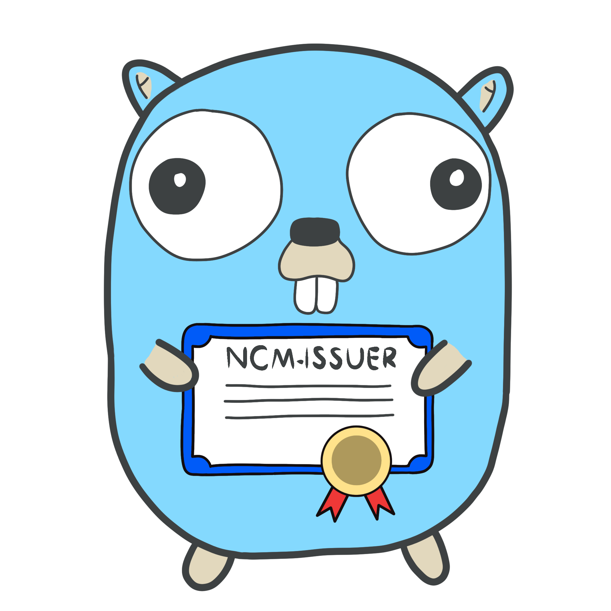

---
hide:
  - navigation
title: Home
---

# ncm-issuer

   

## What is ncm-issuer?

ncm-issuer is a [Kubernetes](https://kubernetes.io) controller (external [cert-manager](https://cert-manager.io/) issuer) that allows to integrate with
[Nokia NetGuard Certificate Manager (NCM)](https://www.nokia.com/networks/products/pki-authority-with-netguard-certificate-manager/)
PKI system to sign certificate requests.

The integration with NCM makes it easy to obtain non-self-signed certificates for applications and to ensure that they are valid and up-to-date.

## How to get started?

Simply click the documentation tab in the navigation panel. All the steps required to install the ncm-issuer are
described there, along with a tutorial on how to issue your first certificate. If you feel that something is missing
in the documentation, please report it to one of the maintainers, and it will definitely be added soon!

## Maintainers

> [:material-email-arrow-right:](mailto:misiektoja-github@rm-rf.ninja)
> Michal Szymanski ([@misiektoja](https://github.com/misiektoja/))

## License

This project is licensed under the terms of **Apache 2.0 License** and available on
[GitHub](https://github.com/nokia/ncm-issuer).

